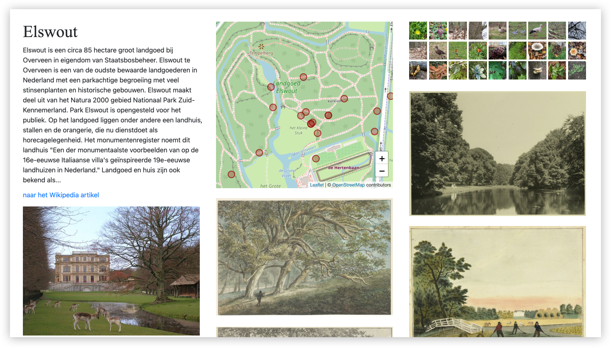

# Landschappen

Dit project bekijkt hoe het verhaal van een landschap te vertellen is door afbeeldingen uit erfgoedcollecties, waarnemingen van flora en fauna, informatie van Wikipedia en historische kaarten te combineren. 

